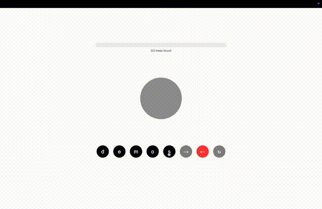

# WordTree

A new word game involving binary trees, anagrams, and tree traversals. This repo contains the code used to find all possible solutions for words within a given bank of words of the same length.

## Table of Contents
- [Overview](#overview)
- [Prerequisites](#prerequisites)
- [Installation](#installation)
  - [Unix/macOS](#unixmacos)
  - [Windows](#windows)
- [Running the Game](#running-the-game)
- [Game Rules](#game-rules)
- [Project Structure](#project-structure)
- [Development](#development)
- [Troubleshooting](#troubleshooting)
- [License](#license)

## Demo



## Prerequisites
- Python 3.x
- pip

## Installation

### Unix/macOS
```bash
cd Documents                                              # Navigate to Documents folder
mkdir WordTree_Game                                       # Make a new folder called WordTree_Game
cd WordTree_Game                                          # Navigate into the new folder
git clone https://github.com/jackdpond/WordTree.git       # Clone this git repository
python3 -m venv venv                                      # Create a virtual environment
source venv/bin/activate                                  # Activate virtual environment
pip install -r requirements.txt                           # Install dependencies
```

### Windows
```bash
cd Documents                                              # Navigate to Documents folder
mkdir WordTree_Game                                       # Make a new folder called WordTree_Game
cd WordTree_Game                                          # Navigate into the new folder
git clone https://github.com/jackdpond/WordTree.git       # Clone this git repository
python -m venv venv                                       # Create a virtual environment
.\venv\Scripts\activate                                   # Activate virtual environment
pip install -r requirements.txt                           # Install dependencies
```

## Running the Game
```bash
python3 site/server.py                                    # Activate the local server
```
Then open http://127.0.0.1:5001 in your browser.

## Game Rules
To gain points, build a binary tree out of five letters such that different traversals of the tree spell distinct words.
For detailed rules, see [rules.md](rules.md)

## Project Structure
```
WordTree/
├── site/                  # Web application files
│   ├── server.py          # Flask server implementation
│   ├── index.html         # Main game interface
│   ├── script.js          # Frontend game logic
│   ├── style.css          # Game styling
│   └── initialize_game.py # Game initialization utilities
│
├── answer_assembly/       # Core game logic and tree generation
│   ├── Tree.py            # Binary tree implementation
│   ├── wordtreev2.py      # Main game logic, finding all possible solutions
│   └── pretty_print_tree.py # Tree visualization utilities
│
├── solutions/             # Generated solutions and game data
├── resources/             # Lists of valid words for different amounts of letters
├── requirements.txt       # Python dependencies
└── rules.md               # Game rules and documentation
```

The project is organized into several key directories:
- `site/` contains all web application components, including the Flask server and frontend files
- `answer_assembly/` houses the core game logic, including the binary tree implementation and word processing
- `solutions/` stores generated game solutions and data
- `resources/` contains lists of valid words that count for the game

## Development

## Troubleshooting

## License
This project is licensed under the MIT License - see the [LICENSE](LICENSE) file for details.

